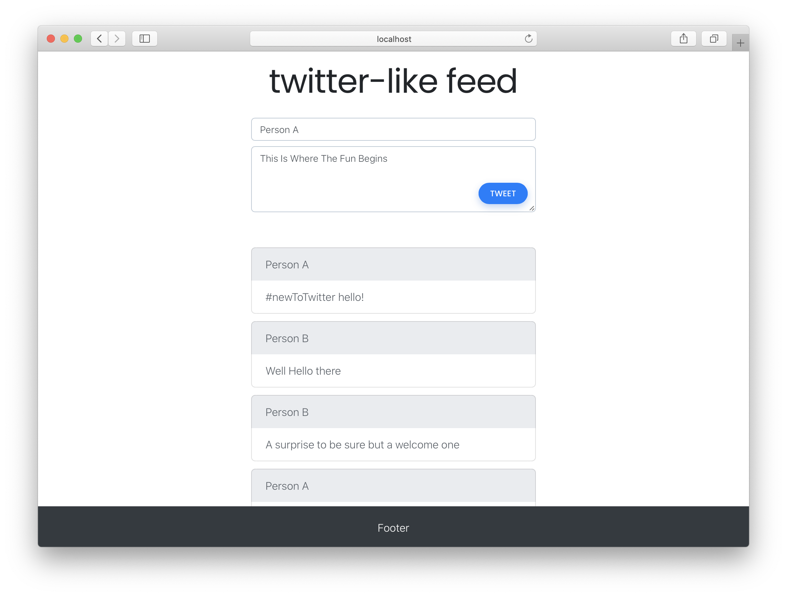

# mern-stack-talk

Short ppt and a simple demo app used during guest lecture to PES students on 2020-11-20.  
run `npm install` on client and server, use `npm start` in respective folders.

I used [marp](https://marpit.marp.app/) to convert markdown to presentation, [create-react-app](https://reactjs.org/docs/create-a-new-react-app.html#create-react-app) for creating the client for the demo app.  
I used [Expose](https://beyondco.de/docs/expose/introduction) during the talk to create a tunnel to my machine. The setup is a bit complex, but this is the best one afaik.

PSA: The explanation I gave to the question asked right at the end wasn't quite right/that straightforward. Have a look at [https://stackoverflow.com/questions/8107856/how-to-determine-a-users-ip-address-in-node](https://stackoverflow.com/questions/8107856/how-to-determine-a-users-ip-address-in-node)

Thanks for tuning in.
