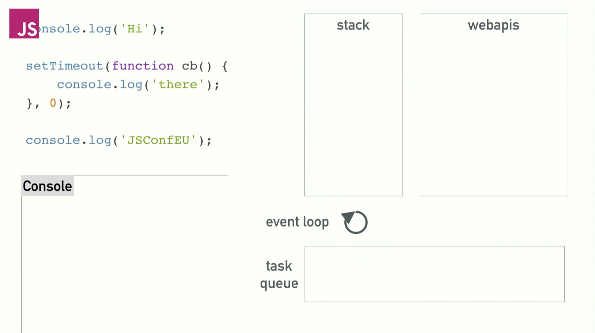

<!-- TODO TODO TODO -->

# **MERN**

MongoDB Express React Node

---

# Me

#### Suhas Kashyap

Dev at Quotient Technology Inc.

Find me on Linkedin/twitter
Mail me at: kashyapsuhas07@gmail.com
These slides + code at: github.com/kashyap07/mern-stack-talk

<!-- TODO -->

---

<!-- _class: lead -->

# Quick Recap

- M - nosql - no relations/schema, documents in collections
- N - JS runtime, logic layer
- E - Node framework, utility fns for web applications, middleware, routing
- R - component based, "reactive", mobile app like

<!-- Not Only SQL - supports mysql query language too -->
<!-- built in web server -->
<!-- mention node js vs browser js -->
<!-- python 3 runtime -->
<!-- node doesn't neccessarily have to be web -->
<!-- ECMASCRIPT -->

---

<!-- _class: lead -->

# The Big Picture

## 

---

# Deeper Dive

## Mongo

- BSON Documents in Collection
- Store JSON natively (but binary)
- Horizontal Scalability - shards
  - Watch: youtu.be/Q-lHpZBh3lQ

<!-- persistent storage vs in memory -->
<!-- vertical - bigger/better machine - scale up -->
<!-- horizontal - many more - scale out -->
<!-- Load distribution but sacrifice strong consistency -->
<!-- https://www.youtube.com/watch?v=Q-lHpZBh3lQ -->

---

# Deeper Dive

## Node

- Event loop
- Async-ness
- Nonblocking - Callbacks and Promises
- npm - node package manager

<!-- but used for browser related js too -->
<!-- server related js => 1 file can call another -->
<!-- for client - build step -->
<!-- yarn -->
<!-- promise.all() -->

---

# Deeper Dive

## Node

### Event Loop

( from: What the heck is the event loop anyway? | Philip Roberts | JSConf EU

youtu.be/8aGhZQkoFbQ)

<!-- Stack - LIFO -->
<!-- Queue - FIFO -->

---

# Deeper Dive

## Node

### Event Loop

( from: What the heck is the event loop anyway? | Philip Roberts | JSConf EU

youtu.be/8aGhZQkoFbQ)

<!-- http://latentflip.com/loupe/?code=JC5vbignYnV0dG9uJywgJ2NsaWNrJywgZnVuY3Rpb24gb25DbGljaygpIHsKICAgIHNldFRpbWVvdXQoZnVuY3Rpb24gdGltZXIoKSB7CiAgICAgICAgY29uc29sZS5sb2coJ1lvdSBjbGlja2VkIHRoZSBidXR0b24hJyk7ICAgIAogICAgfSwgMjAwMCk7Cn0pOwoKY29uc29sZS5sb2coIkhpISIpOwoKc2V0VGltZW91dChmdW5jdGlvbiB0aW1lb3V0KCkgewogICAgY29uc29sZS5sb2coIkNsaWNrIHRoZSBidXR0b24hIik7Cn0sIDUwMDApOwoKY29uc29sZS5sb2coIldlbGNvbWUgdG8gbG91cGUuIik7!!!PGJ1dHRvbj5DbGljayBtZSE8L2J1dHRvbj4%3D -->

---

# Deeper Dive

## Express

- Endpoints
- Middleware
- Alternatives
- Templates

<!-- Template SEO -->
<!-- React SSR -->
<!-- Parses res/res for us -->
<!-- Middleware for logging/auth -->

---

# Deeper Dive

## React

- Single page applications - React router
- State management
- UI Components - reuseability
- JSX Javascript XML

<!-- Fake pages, history is properly stored on browser -->
<!-- component that maintains its own state -->
<!-- Babel for compiling/transpiling jsx/other code -->
<!-- build tools. React can be used by simply including the script too -->

---

# Why this stack works and why it's used

- easy to get into - JS
- JS everywhere, JSON everywhere
- Performance

<!-- interpreted language. ez for noobs -->
<!-- 1 product - 1 team devs work on full stack -->
<!-- Mongo not quite -->
<!-- 1M concurrent tasks -->
<!-- Deployment 3/2/1 servers -->

---

# Current state of MERN development

- Promises
- es6 --> es10
- Building/Bundling
- Typescript
- graphql
- ci/cd
- nginx
- SSR
- Docker

<!-- React Hydrate -->

---

<!-- _class: lead -->

# Walkthrough

Twitter like feed

<!-- es6 stuff -->
<!-- explain hooks -->
<!-- debugging -->
<!-- SEO pug -->

---

<!-- _class: lead -->

# Thank you!

Find these slides + code at
github.com/kashyap07/mern-stack-talk
